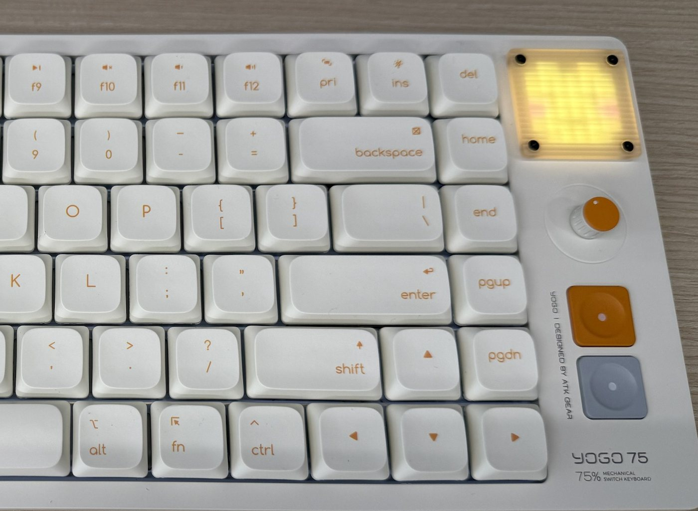
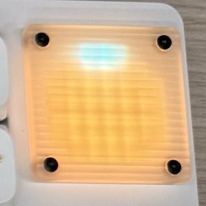
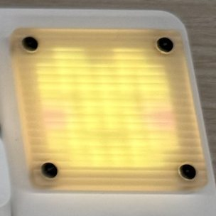
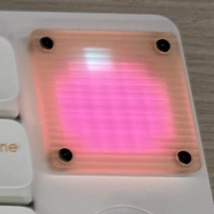
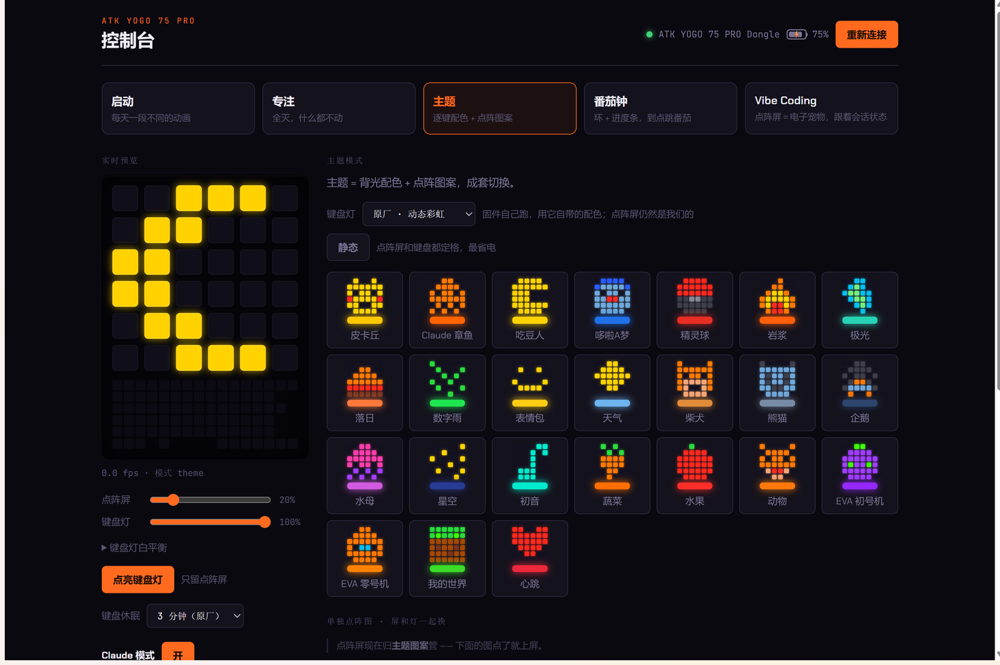

# YogoDot —— ATK YOGO 75 PRO 像素屏 / 背光控制软件

让 **ATK YOGO 75 PRO**(YOGO 75)的像素屏想放什么就放什么:48 张像素图点一下就上屏,24 套主题让背光和小屏一起换色,还有番茄钟和动画。锁屏自动熄灭,不刷固件,不用开官方 ATK HUB。

**Windows 免安装 · 免费开源** · [官网](https://wednesque.github.io/yogodot/) · *[English below](#english)*



<p align="center">
  
  
  
  <br><sub>实拍。屏幕上有一层磨砂灯罩，像素边缘是柔和的</sub>
</p>

## 下载

**[⬇ 下载 YogoDot-windows.zip](https://github.com/Wednesque/yogodot/releases/latest/download/YogoDot-windows.zip)**(15MB 左右)

| 需要 | |
|---|---|
| ✅ Windows 10 / 11 电脑 | 不用装 Python,不用敲命令 |
| ✅ 键盘用 **2.4G 接收器**或**数据线**连电脑 | |
| ❌ **蓝牙连接用不了** | 键盘在蓝牙模式下不接受电脑控制灯光,这是键盘自己的限制 |

1. 下载上面的 zip
2. 右键 → 全部解压缩,放桌面或任意文件夹(设置会存在这个文件夹里)
3. 双击 `YogoDot.exe`。它会待在右下角托盘里:点托盘图标打开软件,右键可以设开机自动启动

**第一次打开 Windows 多半会拦一下**(「Windows 已保护你的电脑」):软件没买代码签名证书,不是病毒。点「更多信息」→「仍要运行」,以后就不会再问了。

## 能做什么



- **48 张像素图**:角色、蔬菜、水果、动物、EVA、我的世界,点一下就上屏,关掉软件再开还记得
- **24 套主题**:一张小屏图案 + 一套 84 键配色,成套切换。颜色按这把键盘的灯珠调过,不会发白
- **会动的主题**:小屏和背光一起动(为了省电,刷新得比较慢)
- **番茄钟**:小屏画一圈进度,到点背光闪一下提醒
- **专注模式**:一键全灭
- **省电**:Win+L 锁屏几秒内全灭、离开 3 分钟自动熄;电量低于 20% 关背光,低于 8% 小屏也关,插上电自动恢复
- **电量**:软件里直接显示电量和是否在充电
- 托盘常驻,可以开机自启,没有黑框

## 常见问题

**会不会弄坏键盘?**
不会。不刷固件、不改按键。画面是实时发给键盘的,不存进键盘里;只有切换背光模式时会改一次键盘设置,跟官方驱动一样。想回到出厂状态,用官方 ATK HUB 的「恢复出厂」。

**要联网吗?**
不用,默认完全离线。只有你手动打开「Claude 模式」(见下文,给程序员的),才会读取电脑上 Claude Code 的登录信息去查用量。

**关掉软件会怎样?**
键盘上留着最后一个画面,直到键盘休眠,之后回到键盘自带的显示。再打开软件会自动补上。

**跟 ATK HUB 冲突吗?**
别同时开,两个软件抢着控制同一把键盘会互相打断。用哪个就退出另一个。

**键盘完全没反应了?**
多半是键盘没电、没开机,或者开关拨在蓝牙档。插上数据线试试能不能打字;能打字就是无线连接的问题,切回 2.4G 档。

**日志在哪?**
`YogoDot.exe` 旁边的 `yogo.log`。如果解压在没有写入权限的目录(比如 `C:\Program Files`),设置和日志会放到 `%LOCALAPPDATA%\YogoDot`。

**怎么卸载?**
托盘图标右键 → 关掉开机自启 → 退出,然后删掉整个文件夹,再删掉桌面和开始菜单里的「YOGO 键盘」快捷方式(第一次运行时自动建的)。

## 已知限制

- 只有 Windows 版;只在 YOGO 75 PRO 上测过(同厂别的带像素屏的型号可能也行,欢迎试完开 issue)
- 蓝牙连接无法控制
- 用「原厂灯效」(键盘自带的那些效果)时,锁屏 / 离开 / 低电量不会自动关背光 —— 那些灯是键盘自己在跑。用我们的主题配色或「熄灭键盘灯」不受影响
- 画面不存进键盘,所以软件要在后台开着

## Claude 模式(给程序员,默认关闭)

如果你在用 [Claude Code](https://claude.com/claude-code),可以在软件左栏打开「Claude 模式」,键盘就变成它的状态灯。关着时这部分完全不出现,也不联网。

打开后会有:

- **顶部胶囊**:鼠标中键唤出,显示 Claude 用量(5 小时 / 本周 / 按模型的周额度)和各会话状态,10 套皮肤、4 种动画可选。**注意:打开后鼠标中键归胶囊用**
- **Vibe 模式**:小屏上一只电子宠物,跟着 Claude 的状态睡觉 / 张望 / 蹦跳 / 耷拉
- **用量**:自动读取本机 Claude Code 的登录信息(`~/.claude/.credentials.json` 或 Windows 凭据管理器)去问 Anthropic

### 让胶囊显示本机会话状态

需要电脑上有 Python,并从本仓库拿 `statusline.py`。把这段合并进 `%USERPROFILE%\.claude\settings.json`(**会替换你原有的 statusLine**):

```json
"statusLine": { "type": "command", "command": "py -3 C:/你放源码的目录/statusline.py" }
```

### 接入远端服务器上的 Claude Code(可选)

桌面这边用 `ssh <主机> tail -F` 拉一条事件流,不需要反向隧道。服务器上:

1. 把 `remote/` 里的 `claude-yogo-hook.sh`、`claude-statusline.sh`、`yogo_name.py` 放进 `~/.claude/hooks/`,前两个 `chmod +x`
2. 把 `remote/settings-hooks.json` 里的 `hooks` 一段合并进服务器的 `~/.claude/settings.json`;再把 `statusLine` 设成 `$HOME/.claude/hooks/claude-statusline.sh`
3. 可选:`remote/yogo-quota.py` 用 systemd --user 常驻,能拿到按模型的周额度

然后在**桌面这边** `YogoDot.exe` 旁边的 `settings.json` 里填上 ssh 主机别名(不是 Claude 的 settings.json):

```json
{ "claude": true, "ssh_host": "你的主机别名" }
```

hook 全部是 `async`、永远 `exit 0`,只往服务器本地文件追加一行,不参与任何权限决策,不会拖慢 Claude。

## 开发者

### 从源码运行

```bash
pip install -r requirements.txt
```

然后双击 `yogo.pyw`。打包成 exe 跑 `build.cmd`(用独立 venv,不动你全局的 Python 环境),产物在 `dist\YogoDot\`。

### 它是怎么工作的

- `kbd.py`:用 Windows HID API(`setupapi` / `hid.dll`,纯 ctypes)直接跟键盘的厂商通道通信。去重、限速、限速时尾沿补发、电量读取、锁屏 / 离开 / 低电量熄灯都在这一层,上层出 bug 也刷不爆设备
- `server.py`:本地 HTTP 服务(127.0.0.1:8787),控制台页面只是遥控器
- `yogo.html`:控制台界面,主题 / 图案 / 动画 / 番茄钟的逻辑目前在这页的 JS 里,由托盘程序用隐藏的 Chrome / Edge 窗口跑着
- `hud.py` + `capsule.py`:Claude 模式的胶囊,PIL 渲染 + Windows 分层窗口
- `paths.py`:打包后只读资源在临时解压目录,可写数据在 exe 旁边

协议来自官方网页版 ATK HUB 的前端代码。像素屏用 `set_dotscreen_matrix`(cmd 59),背光用 `open_sync_led`(cmd 46),都是实时推送,键盘重新上电后不保留(实测行为);切换背光模式时会用 cmd 21 写一次键盘配置。电量是 `power_info`(cmd 48)。

⚠️ 命令表里 `reset_device`(cmd 49,恢复出厂)就夹在常用号段中间。**探协议时千万不要盲扫命令号。**

键盘 LED 的发光效率大约 红:绿:蓝 = 1:4:14,低饱和的颜色在灯珠上会发白。主题色都按这个校过;自己加图案时,最亮的通道拉满、最暗的通道压到 50 以下效果最好。

### 调试(从源码运行时)

- `py -3 hidprobe.py`:列出所有 HID 接口,对键盘厂商通道握手一次
- `py -3 wake.py`:守着等键盘应答,插线 / 开机 / 换档时用
- `py -3 batt.py`:电量和可读配置区的原始字节
- `http://127.0.0.1:8787/kb/status`:连接、电量、熄灯、锁屏状态

「键盘没反应、接收器在系统里一切正常、厂商通道握手不回包」= 键盘不在无线链路上:没电、没开或不在 2.4G 档。

## English

YogoDot controls the 6×6 pixel screen and per-key RGB backlight of the **ATK YOGO 75 PRO** keyboard — an alternative to the official ATK HUB driver. 48 pixel-art images, 24 themes (backlight + screen), animations, pomodoro, auto-off on lock / idle / low battery, battery display. Windows only, no install: [download the zip](https://github.com/Wednesque/yogodot/releases/latest/download/YogoDot-windows.zip), unzip, run `YogoDot.exe`. Works over the 2.4G dongle or USB cable, not Bluetooth (firmware limitation). Offline by default; the optional "Claude mode" shows Claude Code usage and session state on a desktop capsule and as a pet on the screen.

## 许可

MIT。像素图里的角色形象版权归各自所有者,仓库不包含任何官方素材。个人项目,与 ATK、Anthropic 都没有关系,风险自负。字体 Chakra Petch 与 JetBrains Mono 使用 SIL Open Font License(见 `fonts/OFL.txt`)。
